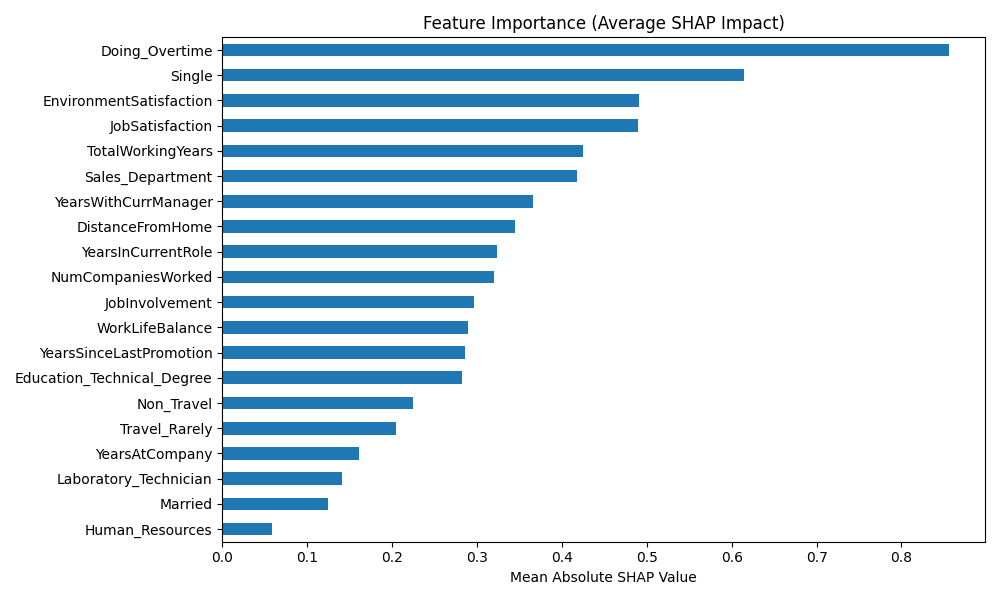

# 👋 Welcome to the Employee Retention Risk Project

This project uses machine learning and explainable AI to help HR teams predict which employees are most at risk of leaving — and why.

---

## 📈 Key Highlights

- Calibrated XGBoost classifier with SMOTE applied inside each CV fold to prevent leakage
- 🔍 Top drivers typically include Overtime, Promotion Rate, and Job Satisfaction
- 🧠 SHAP-based explainability for transparent decision-making
- 📊 HR-ready CSV output + Streamlit dashboard

---

## 📘 View the Full Notebook

---

## 📂 Explore the Repository

- 🔍 View the full README on [GitHub](https://github.com/SonnyBD/employee-retention-risk)

---

_Created by Sonny Bigras-Dewan — 2025_
